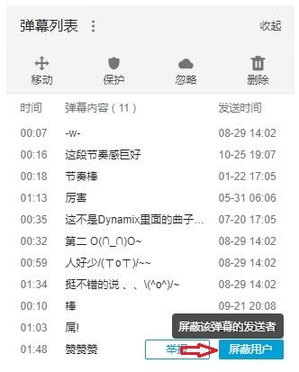

##这是什么?
一个可以离线查找弹幕发送者的工具

##这有哪些功能？

* 通过用户hash值查找弹幕发送者uid
* 方便的通过链接进入用户空间

##如何使用？
* 使用Qt5编译
* 第一次打开软件需创建数据库，时间较长，需占用空间约18G
* 打开弹幕列表，找到要查找的弹幕，点击屏蔽用户
  
* 进入屏蔽设定->屏蔽用户
  
  
* 选择最下方的hash值，将其填入对话框，点击查找
  
  
* 取消屏蔽（需要的话……

##有什么特点？
* 目前B站用户uid已超过5亿，本软件支持查找10亿以内uid
* B站使用的是CRC32对用户uid进行hash，10亿以内会有碰撞，本软件支持查找所有结果
* 支持离线查找